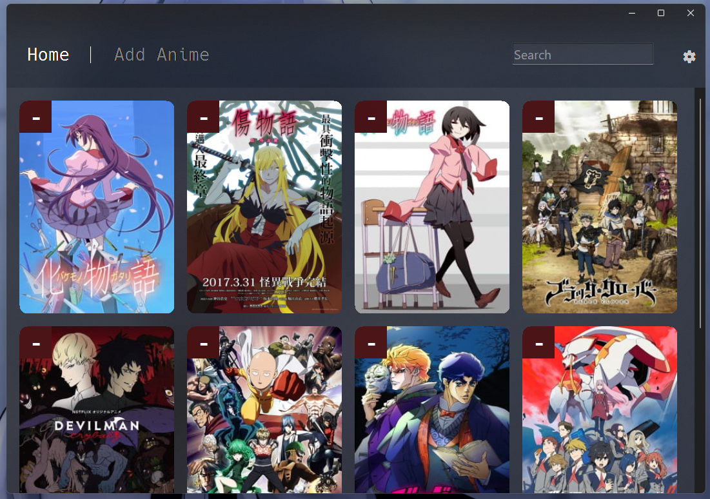

# anitrack
Trying out WinForms in python through clr under the pretext of making an 'anime tracker'.  

  
As you may have noticed, it's about as useful as a glorified text document containing your watchlist - which is because it's supposed to be my test drive of WinForms in python through clr more than anything else.
By the way - notice that sweet acrylic - that part of the code is adapted from this [qtacrylic](https://github.com/nullex86/qtacrylic) repo.  
Don't expect it to:
- Read you the newspaper
- Do anything useful other than adding\removing anime in a json file
- Be customizable (that i'll add later, of course)
- Be bug-free (it's got a few and i aint fixing em)

Anime Data is fetched from [api.jikan.moe](https://api.jikan.moe)
